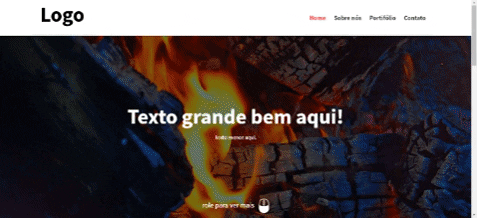

<h1 align="center"> Design Responsivo </h1> 

<h1 align="center"> Web </h1>
<h1 align="center"></h1>

<h1 align="center"> Device </h1>
<h1 align="center"></h1>

## Indice

- [Sobre](#-sobre)
- [Tecnologias Ultilizadas](#-tecnologias-ultilizadas)
- [Como baixar o projeto](#-como-baixar-o-projeto)

---

## 🔖 Sobre

O projeto **DR** é um site web que foi criado dentro do curso **Desenvolvimento Responsivo com HTML5, CSS3 e Javascript** com o intuito de colocar em prática todo o conteúdo estudado durante o curso.

---

## 🚀 Tecnologias Ultilizadas

- HTML 5
- CSS 3
- JavaScript
- [Sass](https://sass-lang.com/)
- [JQuery](https://jquery.com/)  
- [PHP](https://www.php.net/)

---

## 📁 Como baixar o projeto

```bash
    # obs: instalar WampServer para abrir o projeto na web
    
    # clonar repositório
    $ git clone https://github.com/Phguima/ResponsiveDesign.git

    # instalar NodeJS para rodar o Sass
    npm install -g node-sass

    # entrar no repositório
    cd ResponsiveDesign
```
---
Desenvolvido por Pedro Guimarães